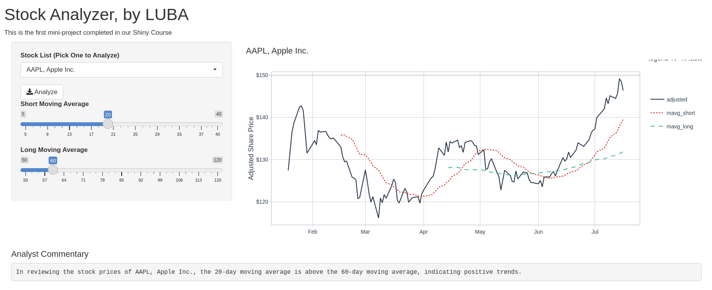

# Stock Analyzer

This is a simple APP made during the DS4B-202 Shiny Developer Course. Here you will find all stocks from S&P500 and a Moving Avarage analysis.

The app have some interactive components and was made using `{shiny}`.

## Preview

## Running the app

In order to run the app, you will need:

- clone the repo
- install all dependencies
- run the `stock_analyzer.R` script. 

For now, all UI and server will be together, but that is something that we'll seperate in the future.
